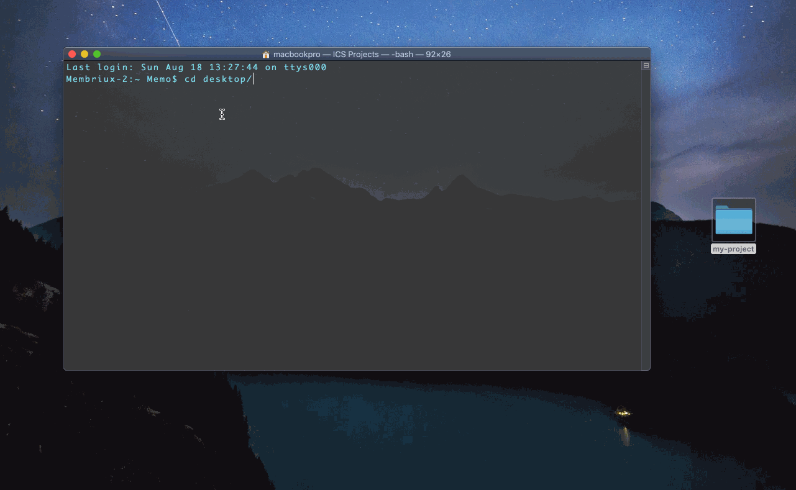
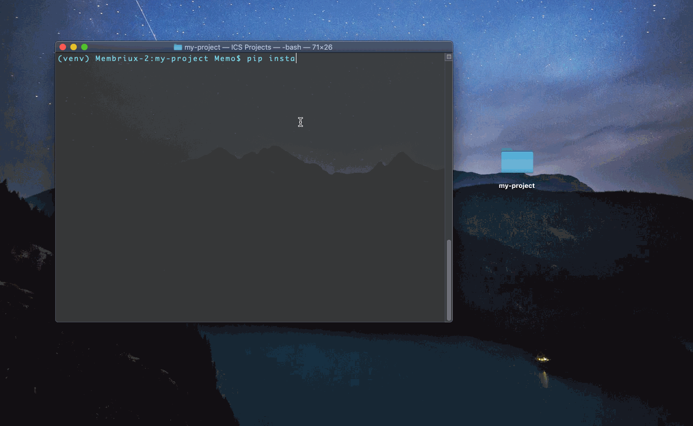
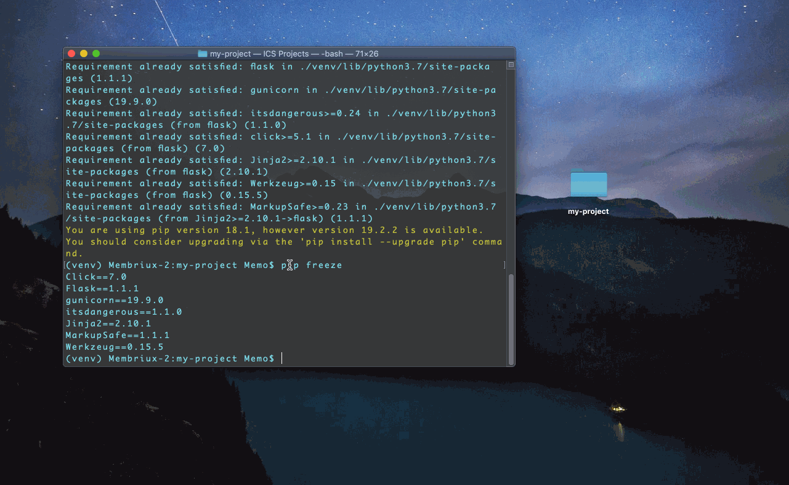
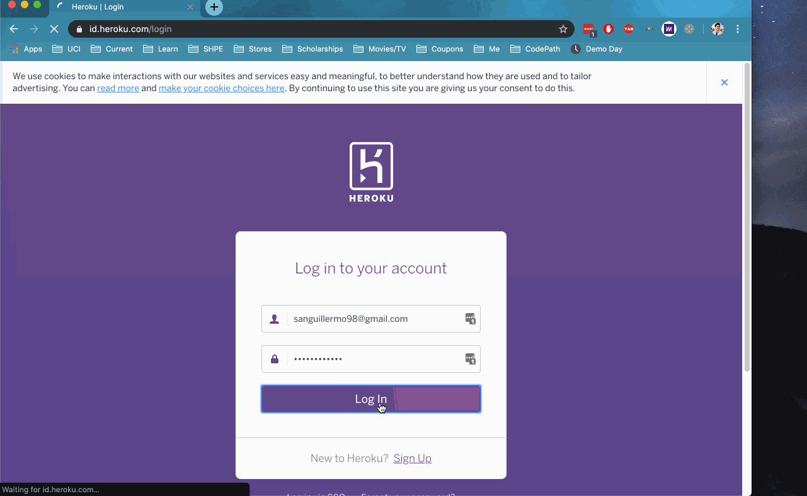

⚠️NOTE: HEROKU NO LONGER WILL HOST FREE APPS. YOU WILL HAVE TO PAY NOW. 
However, this tutorial is still usable if you do plan host on heroku
If you want a free hosting site, I would checkout http://membriux.pythonanywhere.com/

##### `author` [@membriux](https://github.com/membriux)
##### Tags: `flask` `deploy` `heroku` `python`

# Python-Flask Web App Starter
This repo contains the necessary files to work on your next Python-Flask web application and **deploy** it to heroku
Feel free to **[download/fork](/heroku-webapp-starter.zip)** it so you can use it as a reference!

## How to Deploy Flask-Python Web App on Heroku

#### 0. [Download](https://github.com/membriux/heroku-python-webapp-starter/blob/master/heroku-webapp-starter.zip?raw=true) this repo as a zip with all the project starter files

### On your Terminal:

#### 1. Install virtual environment (in project directory):
- `cd my-project`
- `python3 -m venv venv`

#### 2. Activate virtual environment for your project:
- `source venv/bin/activate`

#### 3. Install basic requirements for web app in Flask:
 - `pip install flask gunicorn`
 Note: make sure to have pip installed

#### 4. Verify requirements were installed with the desired versions:
- `pip freeze`

#### 5. Create requirements.txt so Heroku understands what your web app needs
- `pip freeze > requirements.txt`

#### 6. Create Procfile (for Heroku):
- `vi Procfile`

On your Procfile file, type this:
- `web: gunicorn app:app`

#### 7. Deploy: Go to [Heroku Dashboard](http://heroku.com) -> sign in -> create app, and deploy using Github

#### Running Locally

`export FLASK_APP=app.py
flask run
`

Development mode
`export FLASK_APP=app.py
export FLASK_ENV=development
flask run
`
